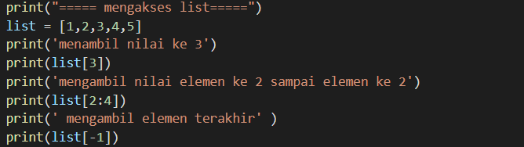
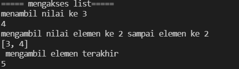
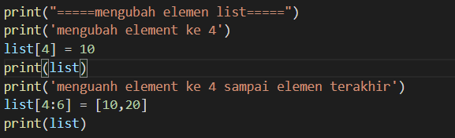
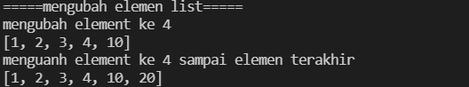
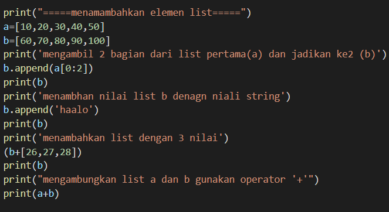
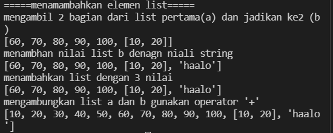
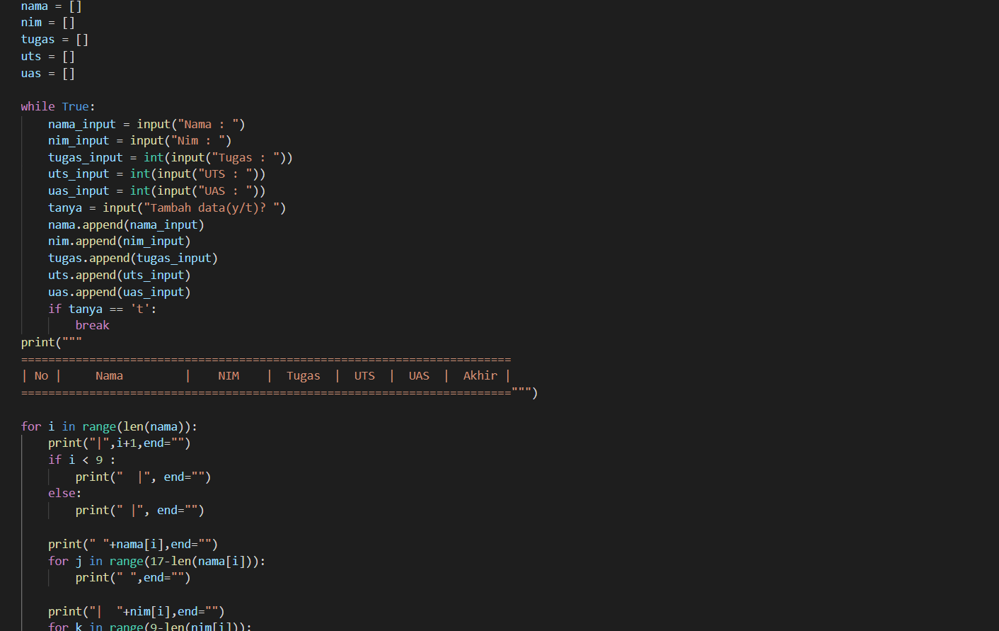
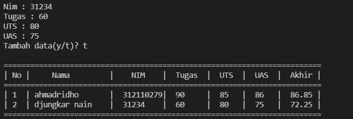
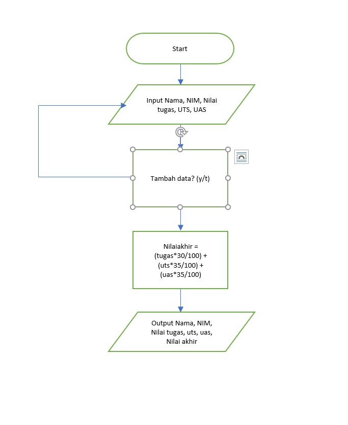

# labpy04
## LIST
##### List adalah tipe data yang paling serbaguna yang tersedia dalam bahasa Python, yang dapat ditulis sebagai daftar nilai yang dipisahkan koma (item) antara tanda kurung siku. Hal penting tentang daftar adalah item dalam list tidak boleh sama jenisnya
## latihan
## 1. mengakses list





 ### saya membauat penjelasan membuat list denagan nilai [1,2,3,4,5]
### Untuk menampilkan elemen ketiga pada sebuah list, gunakan.

	print(list[3])

### jika ingin mengambil elemen ke dua sampai ke empat gunakan
    print(list[2:4])

### jika mengambil elemen terakhir gunakan
     print(list[-1])





## mengubah list





### mengubah list elemen 4 dengan nilai lain

      list[4]=10
      print(list)
### mengubah elemen ke 4 sampai dengan elemen terakhir
    list[4:6] = [10,20]
    print(list)





### menambah elemen list





 ### untuk mengambil 2 bagian dari list a dan tambahkan di list b menggunkan append
      b.append(a[0:2])
      print(b)

### menambhakn list b denagn nilai string.
     b.append("haalo")
     print(b)

### menambahkan 3 nilai ke dalam list b
    (b+[26,27,28])
    print(b)

### meggambungkan list b denagn nilai a gunakan operator '+'
    print(a+b)




# tugas praktikum 4





### pejelasan
1. (Deklarasi list) ketika menginput data, maka data akan dimasukan ke dalam list ini
```python
_nama = []
_nim = []
_tugas = []
_uts = []
_uas = []
_akhir = []
```

2. Membuat program perulangan menggunakan _while loop_ dengan nilai True
```python
while True:
```

3. Pada variabel `_nama.append` dan `_nim.append` inputan akan ditambahkan ke dalam list dengan method `.append`, sedangkan untuk nilai(Tugas, UTS dan UAS) dimasukan ke variable `_akhir.append` terlebih dahulu untuk di jumlahkan
```python
    _nama.append(input("Nama : "))
    _nim.append(input("NIM  : "))
    tugas = int(input("Nilai Tugas  : ")); _tugas.append(tugas)
    uts   = int(input("Nilai UTS    : ")); _uts.append(uts)
    uas   = int(input("Nilai UAS    : ")); _uas.append(uas)
    _akhir.append(tugas * 30/100 + uts * 35/100 + uas * 35/100)
```

4. Program input tanya [y/t], apabila jawaban t atau T, maka program inputan dihentikan statement `break` dan akan menampilkan data yang sudah diinput
```python
_tanya = input("Tambah data lagi? [y/t]: ")
    print()
    if(_tanya == "t" or _tanya =="T"):
        break
```

5. Untuk membuat header table, menggunakan `print(73*"=")`, fungsinya membuat "=" sebanyak 73 sebagai garis, dan menggunakan format string agar terlihat rapih. 
```python
print(73*"=")
print("| {0:^2} | {1:^18} | {2:^9} | {3:^5} | {4:^5} | {5:^5} | {6:^7} |".format("No", "Nama", "NIM", "Tugas", "UTS", "UAS", "Akhir"))
print(73*"=")
```

6. Deklarasi `no = 0` untuk membuat nomor pada isi table, lalu membuat perulangan dengan `for`
- Perulangan `nama, nim, tugas, uts, uas`, sesuai urutan yang ada di dalam `zip`
- Pada list yang dimaksud, `in zip` berfungsi untuk membungkus semua list
```python
no = 0
for nama, nim, tugas, uts, uas, akhir in zip(_nama, _nim, _tugas, _uts, _uas, _akhir):
```

7. Membuat isi table sesuai dengan inisialisi diatas, dengan format string agar terlihat rapih
```python
no += 1    
    print("| {0:>2} | {1:<18} | {2:>9} | {3:>5} | {4:>5} | {5:>5} | {6:>7.2f} |".format(no, nama, nim, tugas, uts, uas, akhir))
```

8. Untuk membuat footer atau garis paling bawa ketika looping isi table selesai
```python
print(73*"=")
```

### Output




## berikut flowchart nya





